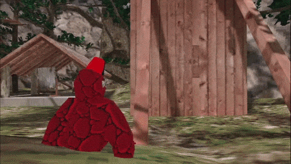

# MonkeWallWalk
A mod for Gorilla Tag that allows you to walk on walls with the palms of your hand.

# [Download](https://github.com/TrueTamashii/MonkeWallWalk/blob/44783318507b5b452da3f44fb90a0070974e9035/WallWalking.dll?raw=true)

To use face the palm of your hands to the wall you want to walk up and it will pull you towards it.

The max distance from the wall is configurable in the .cfg file which generates when you run the game with the mod.

# 

**Current Version:**
  1.0.0.0

**Latest Updates:**
  Added this repo

**Planned Updates:**
  Full rework as this was my first mod
  More control over the mod
  Maybe a toggleable indication system
